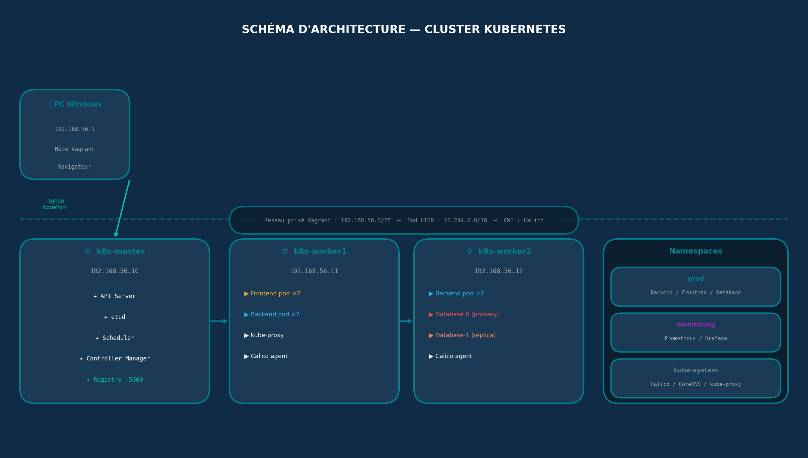
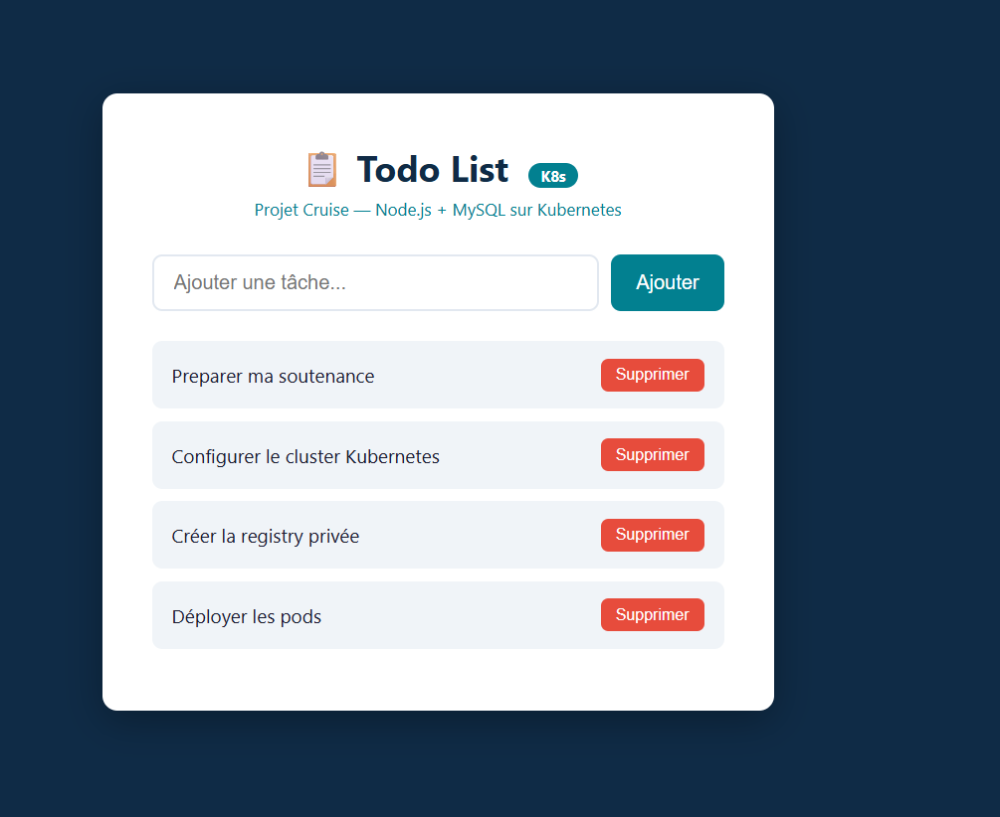

# Cruise — Kubernetes Cluster from Scratch (kubeadm · Calico · MariaDB · Prometheus)

🇬🇧 [English](#english) · 🇫🇷 [Français](#français)



---

## English

### Overview

Cruise is a **self-managed Kubernetes cluster** built from scratch with **kubeadm** on three virtual machines, as part of my Bachelor's degree in Cloud Systems & Security at ETNA. The goal was to act as the DevOps architect of a company: design the infrastructure, then deploy and operate a three-tier web application on it.

Managed Kubernetes services (EKS, GKE, AKS) were not allowed, and **every container image had to be built in-house** (no Docker Hub images except Alpine, Registry and monitoring tools). The images are stored in a **private Docker registry**.

The deployed application is a **Todo List** (Node.js frontend + Node.js REST API + MariaDB), running with replication, persistent storage and full monitoring.



### Skills demonstrated

- **Kubernetes administration**: cluster bootstrap with kubeadm, Calico CNI, namespaces, labels, kubectl operations
- **Containerization**: custom Dockerfiles for each component, private Docker registry, image pull secrets
- **Workloads**: Pods, Deployments / ReplicaSets with rolling updates, StatefulSets, DaemonSets
- **Networking**: ClusterIP and NodePort Services, service discovery with CoreDNS, Calico pod networking
- **Storage**: PersistentVolumes and PersistentVolumeClaims for the database
- **Database high availability**: MariaDB primary / replica replication in a StatefulSet
- **Configuration management**: ConfigMaps and Secrets to keep images environment-agnostic
- **Observability**: Prometheus, Grafana and Node Exporter
- **Infrastructure as Code**: VMs provisioned with Vagrant, all Kubernetes objects described in YAML manifests

### Infrastructure

| Node | Role | IP | Resources |
|---|---|---|---|
| k8s-master | Control plane (API Server, etcd, Scheduler, Controller Manager) + private registry `:5000` | 192.168.56.10 | 2 vCPU · 2 GB RAM · 20 GB |
| k8s-worker1 | Worker (application pods) | 192.168.56.11 | 2 vCPU · 2 GB RAM · 20 GB |
| k8s-worker2 | Worker (application and database pods) | 192.168.56.12 | 2 vCPU · 2 GB RAM · 20 GB |

| Network | Value |
|---|---|
| Host network (Vagrant private) | 192.168.56.0/28 |
| Pod CIDR | 10.244.0.0/16 |
| Service CIDR | 10.96.0.0/12 |
| CNI | Calico |
| Internal DNS | CoreDNS |
| External access | NodePort 30000 |

**Stack:** VirtualBox · Vagrant · Ubuntu 22.04 LTS · containerd · Kubernetes (kubeadm) · Calico · Node.js / Express · MariaDB · Prometheus · Grafana

### Application architecture

| Component | Kubernetes objects | Replicas | Exposure |
|---|---|---|---|
| Frontend (Node.js + Express, static HTML/CSS/JS) | Deployment + ReplicaSet | 2 | Service **NodePort** `30000` |
| Backend (Node.js + Express REST API) | Deployment + ReplicaSet | 2 | Service **ClusterIP** |
| Database (MariaDB) | StatefulSet + PVC | 2 (primary + replica) | Service **ClusterIP** |

| Namespace | Content |
|---|---|
| `prod` | Frontend, backend, database |
| `monitoring` | Prometheus, Grafana, Node Exporter |
| `kube-system` | Calico, CoreDNS, kube-proxy |

### Implementation steps

| # | Step | What was done |
|---|---|---|
| 1 | **Architecture design** | Sizing of the 3 VMs, network plan, choice of Kubernetes objects and tools ([diagram](images/architecture.png)) |
| 2 | **Docker images** | Custom Dockerfiles for the frontend, backend and database |
| 3 | **Private registry** | Docker registry on the master hosting the 3 images ([screenshot](images/registry.png)) |
| 4 | **Cluster setup** | `kubeadm init` on the master, workers joined, Calico deployed: 3 nodes `Ready` ([screenshot](images/nodes-ready.png)) |
| 5 | **Pods** | Components deployed in the `prod` namespace from the private registry; backend connected to the database ([screenshot](images/pods-running.png)) |
| 6 | **Services** | ClusterIP for internal traffic, NodePort for external access; DNS-based service discovery ([screenshot](images/services.png)) |
| 7 | **Deployments** | Static pods replaced by Deployments with 2 replicas for the frontend and backend ([screenshot](images/deployments.png)) |
| 8 | **Persistent storage** | PV / PVC for the database: data survives pod restarts and rescheduling ([screenshot](images/persistent-volume.png)) |
| 9 | **Database cluster** | MariaDB StatefulSet: `todo-database-0` primary (binlog), `todo-database-1` read-only replica, replication in sync ([StatefulSet](images/statefulset.png), [replication](images/mariadb-replication.png)) |
| 10 | **Monitoring** | Prometheus + Grafana in the `monitoring` namespace, Node Exporter as a DaemonSet on every worker ([screenshot](images/monitoring.png)) |

### Repository structure

```
.
├── backend/              # REST API (Node.js / Express) + Dockerfile
├── frontend/             # Web UI (Node.js / Express) + Dockerfile
├── database/             # MariaDB image: Dockerfile, entrypoint.sh, init.sql
├── k8s/
│   ├── namespaces/       # Namespace definitions
│   ├── frontend/         # Deployment + Service
│   ├── backend/          # Deployment + Service
│   ├── database/         # StatefulSet, Services, PV / PVC
│   └── monitoring/       # Prometheus, Grafana, Node Exporter
├── docs/                 # Detailed documentation for each step
├── images/               # Diagrams and screenshots
├── Vagrantfile           # Provisioning of the 3 VMs
├── docker-compose.yml    # Local run without Kubernetes
├── Architecture_Kubernetes.pptx
└── rapport_cruise.docx
```

### Getting started

**Run locally with Docker Compose:**
```bash
docker compose up --build
```

**Deploy on the cluster:**
```bash
# 1. Create the VMs
vagrant up

# 2. Build the images and push them to the private registry (on the master)
docker build -t 192.168.56.10:5000/todo-backend ./backend
docker push 192.168.56.10:5000/todo-backend
# same for frontend and database

# 3. Apply the manifests
kubectl apply -f k8s/namespaces/
kubectl apply -f k8s/database/
kubectl apply -f k8s/backend/
kubectl apply -f k8s/frontend/
kubectl apply -f k8s/monitoring/
```

The application is then available at **http://192.168.56.10:30000**.
See the [`docs/`](docs/) folder for the detailed procedure of each step.

### Security note

This is a lab environment: the credentials used in the manifests and screenshots are for testing only. In production I would add TLS everywhere, external secret management (e.g. Vault or Sealed Secrets), RBAC, NetworkPolicies and a distributed storage backend.

### Author

**Steven Gilaur T.** — Systems & Network Administrator
Bachelor's degree in Cloud Systems & Security — ETNA

---

## Français

### Présentation

Cruise est un **cluster Kubernetes auto-hébergé**, monté de zéro avec **kubeadm** sur trois machines virtuelles, dans le cadre de mon Bachelor Systèmes Cloud et Sécurité à l'ETNA. L'objectif était d'endosser le rôle d'architecte DevOps d'une entreprise : concevoir l'infrastructure, puis y déployer et exploiter une application web trois tiers.

Les services Kubernetes managés (EKS, GKE, AKS) étaient interdits, et **toutes les images de conteneurs devaient être construites en interne** (aucune image du Docker Hub sauf Alpine, Registry et les outils de monitoring). Les images sont stockées dans une **registry Docker privée**.

L'application déployée est une **Todo List** (frontend Node.js + API REST Node.js + MariaDB), avec réplication, stockage persistant et monitoring complet.

### Compétences mises en œuvre

- **Administration Kubernetes** : initialisation du cluster avec kubeadm, CNI Calico, namespaces, labels, opérations kubectl
- **Conteneurisation** : Dockerfiles personnalisés pour chaque composant, registry Docker privée, secrets de pull d'images
- **Workloads** : Pods, Deployments / ReplicaSets avec mises à jour progressives, StatefulSets, DaemonSets
- **Réseau** : Services ClusterIP et NodePort, découverte de services avec CoreDNS, réseau des pods avec Calico
- **Stockage** : PersistentVolumes et PersistentVolumeClaims pour la base de données
- **Haute disponibilité de la base** : réplication MariaDB primary / replica dans un StatefulSet
- **Gestion de configuration** : ConfigMaps et Secrets pour des images indépendantes de l'environnement
- **Observabilité** : Prometheus, Grafana et Node Exporter
- **Infrastructure as Code** : VMs provisionnées avec Vagrant, tous les objets Kubernetes décrits en manifestes YAML

### Infrastructure

| Nœud | Rôle | IP | Ressources |
|---|---|---|---|
| k8s-master | Control plane (API Server, etcd, Scheduler, Controller Manager) + registry privée `:5000` | 192.168.56.10 | 2 vCPU · 2 Go RAM · 20 Go |
| k8s-worker1 | Worker (pods applicatifs) | 192.168.56.11 | 2 vCPU · 2 Go RAM · 20 Go |
| k8s-worker2 | Worker (pods applicatifs et base de données) | 192.168.56.12 | 2 vCPU · 2 Go RAM · 20 Go |

| Réseau | Valeur |
|---|---|
| Réseau hôte (privé Vagrant) | 192.168.56.0/28 |
| CIDR des pods | 10.244.0.0/16 |
| CIDR des services | 10.96.0.0/12 |
| CNI | Calico |
| DNS interne | CoreDNS |
| Accès externe | NodePort 30000 |

**Stack :** VirtualBox · Vagrant · Ubuntu 22.04 LTS · containerd · Kubernetes (kubeadm) · Calico · Node.js / Express · MariaDB · Prometheus · Grafana

### Architecture applicative

| Composant | Objets Kubernetes | Réplicas | Exposition |
|---|---|---|---|
| Frontend (Node.js + Express, HTML/CSS/JS) | Deployment + ReplicaSet | 2 | Service **NodePort** `30000` |
| Backend (API REST Node.js + Express) | Deployment + ReplicaSet | 2 | Service **ClusterIP** |
| Base de données (MariaDB) | StatefulSet + PVC | 2 (primary + replica) | Service **ClusterIP** |

| Namespace | Contenu |
|---|---|
| `prod` | Frontend, backend, base de données |
| `monitoring` | Prometheus, Grafana, Node Exporter |
| `kube-system` | Calico, CoreDNS, kube-proxy |

### Étapes de réalisation

| # | Étape | Réalisation |
|---|---|---|
| 1 | **Conception de l'architecture** | Dimensionnement des 3 VMs, plan réseau, choix des objets Kubernetes et des outils ([schéma](images/architecture.png)) |
| 2 | **Images Docker** | Dockerfiles personnalisés pour le frontend, le backend et la base de données |
| 3 | **Registry privée** | Registry Docker sur le master hébergeant les 3 images ([capture](images/registry.png)) |
| 4 | **Installation du cluster** | `kubeadm init` sur le master, ajout des workers, déploiement de Calico : 3 nœuds `Ready` ([capture](images/nodes-ready.png)) |
| 5 | **Pods** | Déploiement des composants dans le namespace `prod` depuis la registry privée ; backend connecté à la base ([capture](images/pods-running.png)) |
| 6 | **Services** | ClusterIP pour le trafic interne, NodePort pour l'accès externe ; découverte de services par DNS ([capture](images/services.png)) |
| 7 | **Deployments** | Remplacement des pods statiques par des Deployments avec 2 réplicas pour le frontend et le backend ([capture](images/deployments.png)) |
| 8 | **Stockage persistant** | PV / PVC pour la base : les données survivent aux redémarrages et replanifications des pods ([capture](images/persistent-volume.png)) |
| 9 | **Cluster de base de données** | StatefulSet MariaDB : `todo-database-0` primary (binlog), `todo-database-1` replica en lecture seule, réplication synchronisée ([StatefulSet](images/statefulset.png), [réplication](images/mariadb-replication.png)) |
| 10 | **Monitoring** | Prometheus + Grafana dans le namespace `monitoring`, Node Exporter en DaemonSet sur chaque worker ([capture](images/monitoring.png)) |

### Structure du dépôt

```
.
├── backend/              # API REST (Node.js / Express) + Dockerfile
├── frontend/             # Interface web (Node.js / Express) + Dockerfile
├── database/             # Image MariaDB : Dockerfile, entrypoint.sh, init.sql
├── k8s/
│   ├── namespaces/       # Définition des namespaces
│   ├── frontend/         # Deployment + Service
│   ├── backend/          # Deployment + Service
│   ├── database/         # StatefulSet, Services, PV / PVC
│   └── monitoring/       # Prometheus, Grafana, Node Exporter
├── docs/                 # Documentation détaillée de chaque étape
├── images/               # Schémas et captures
├── Vagrantfile           # Provisionnement des 3 VMs
├── docker-compose.yml    # Lancement local sans Kubernetes
├── Architecture_Kubernetes.pptx
└── rapport_cruise.docx
```

### Démarrage

**En local avec Docker Compose :**
```bash
docker compose up --build
```

**Sur le cluster :**
```bash
# 1. Créer les VMs
vagrant up

# 2. Construire les images et les pousser dans la registry privée (sur le master)
docker build -t 192.168.56.10:5000/todo-backend ./backend
docker push 192.168.56.10:5000/todo-backend
# idem pour frontend et database

# 3. Appliquer les manifestes
kubectl apply -f k8s/namespaces/
kubectl apply -f k8s/database/
kubectl apply -f k8s/backend/
kubectl apply -f k8s/frontend/
kubectl apply -f k8s/monitoring/
```

L'application est ensuite accessible sur **http://192.168.56.10:30000**.
Le dossier [`docs/`](docs/) détaille la procédure de chaque étape.

### Note de sécurité

Il s'agit d'un environnement de lab : les identifiants présents dans les manifestes et les captures servent uniquement aux tests. En production, j'ajouterais du TLS partout, une gestion externe des secrets (Vault ou Sealed Secrets par exemple), du RBAC, des NetworkPolicies et un stockage distribué.

### Auteur

**Steven Gilaur T.** — Administrateur Systèmes et Réseaux
Bachelor Systèmes Cloud et Sécurité — ETNA
